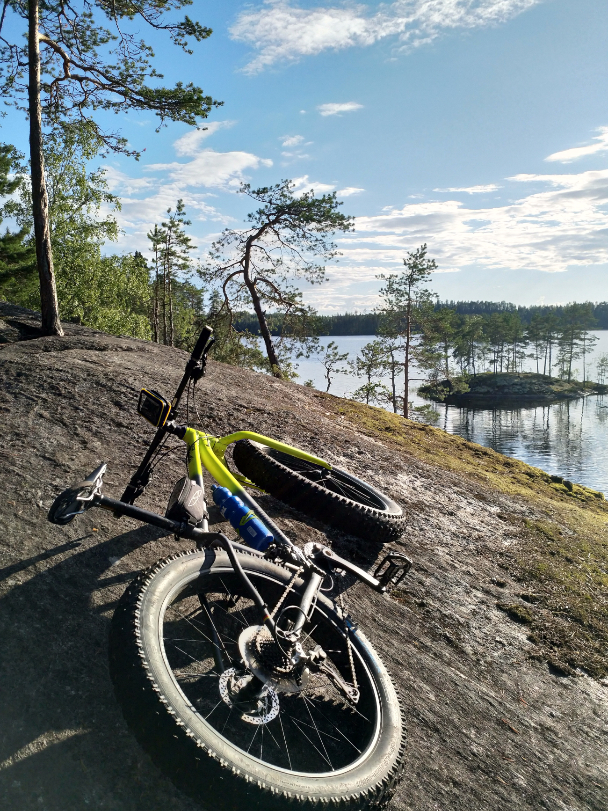

# Mountain bike Route Creator

## Summary

MTB route creator will create your next MTB route automatically. It will take some input. For example location, time you have, what kind of terrain etc. Using these inputs it will create your route that you can display and export it to use on a ride.

## Background

Last summer we travelled around Finland with our caravan. I had my fatbike with me so I could have a ride in many new places. Problem that I faced in many place was that it was really hard to found any good routes to have a ride. 

There are sites like Jälki (https://jalki.fi/) and MTB Reitti.fi (https://mtbreitti.fi/) where you can found routes made by others. Other way to found routes is using some sports app where you can find heatmaps that shows where many people have been riding with MTB. These work quite well when you are some place where have been lot of riders. But if you go some smaller place where aint some many riders you normally cannot find any allready made route or the heatmaps arent showing anything. Specially problem with heat maps is that it requires lot of rider and rides before it shows anything.

## How is it used?

For creating a route a user has to put in some parameters of himself and what kind of routes he likes. Of course you could alter this for every route creation. There parameter could be for example.

- What kind of surface you prefer
   - Gravel road
   - Forest road
   - Trail
   -Single track
- What kind of terrain you prefer
   - Lot of climbs
   - Some climb
   - Flat
- What kind of bike you have
   - Normal bike
   - MTB with front suspension
   - MTB with full suspension
   - Fatbike
   - Gravel

For creating specific routes you have also but in time you want to spend on to route and of course the starting point. Also for estimating the time it takes for a rider on course varies a lot. For estimating the rides abilities could be achieved by some questionnaire or by submitting data of some old rides.

After the information has been entered the route will be created and displayed on map. Also users can download the route for example as gpx files and use it in some mobile app or gps device.

## Data sources and AI methods

This only could work if you have a lot of information about different routes that rides have been using. Many riders use some mobile app or gps device on their rides and this data would be essential for this to work. Of course getting this is not going to be an easy task. 

From the data of routes and maybe using this with come map data you should try to figure out some information about the route.
What kind of surface it is
How big climbs there is
How fast you can go 

Also in the longer run you could try to map the routes and what the kind of surface etc they have by having videos of routes and analyzing them using ML. 

## What next?

I have asked the data of my rides from Sports tracker that I have been using to track my rides. When I get the data I try to get useful information from it and play with it. I have quite a lot of rides from Sipoonkorpi so for that area it could be useful. 

